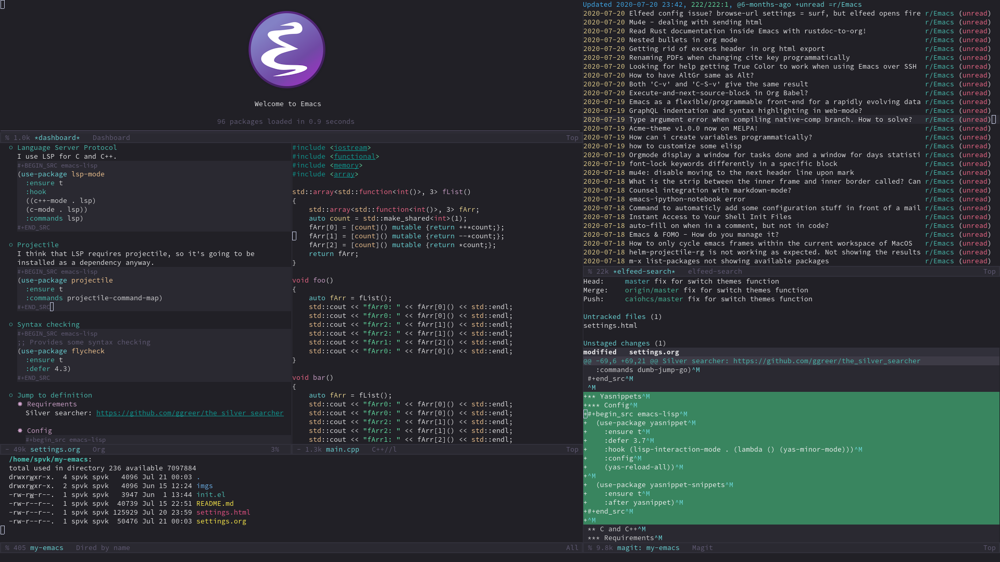
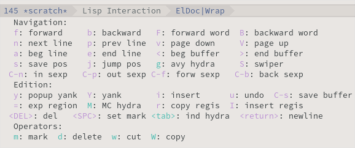

# My Emacs configuration



This is my Emacs configuration, I use it for:

-   Programming languages (C, C++, Go, Javascript, Python, Lisp, Shell script)
-   Markup languages (Latex, HTML, CSS, Org)
-   Other languages (Makefile, yaml, dockerfile)
-   RSS
-   Media player
-   Window manager
-   File manager
-   Password manager
-   Wiki
-   Blog


# Installation

-   Copy init.el and settings.org to ~/.emacs.d/ or ~/.config/emacs


# Programming


## Magit

```emacs-lisp
(use-package magit
  :straight t
  :bind (("C-x g" . magit-status)))
```


## Company

Company is a text completion framework.

```emacs-lisp
(use-package company
  :straight t
  :commands company-mode
  :bind (:map company-active-map
	 ("C-n" . 'company-select-next)
	 ("C-p" . 'company-select-previous))
  :config
  (use-package company-quickhelp
    :straight t
    :hook (company-mode . (lambda () (company-quickhelp-local-mode)))))
```


## Language Server Protocol

LSP gives Emacs IDE features.

```emacs-lisp
(use-package lsp-mode
  :straight t
  :hook
  ((c++-mode . lsp)
   (c-mode . lsp)
   (js-mode . lsp)
   (python-mode . lsp))
  :commands lsp)

(use-package company-lsp
  :straight t
  :after (lsp-mode company)
  :commands company-lsp)
```


## Projectile

```emacs-lisp
(use-package projectile
  :straight t
  :defer 5.2) 
```


## Syntax checking

```emacs-lisp
(use-package flycheck
  :straight t
  :defer 4.3)
```


## Jump to definition

It's good to have two frameworks for jumping to definition (lsp also provides its own functions).


### Requirements

Silver searcher: <https://github.com/ggreer/the_silver_searcher>


### Config

```emacs-lisp
(use-package dumb-jump
  :straight t
  :config
  (setq dumb-jump-selector 'ivy)
  :commands dumb-jump-go)
```


## C and C++


### Requirements

-   Requires clang installed on the system.
-   Requires ccls installed on the system. <https://github.com/MaskRay/ccls>

I'm assuming that the ccls binary is at /usr/bin/ccls.


### Config

```emacs-lisp
(use-package ccls
  :after lsp-mode
  :straight t
  :config (setq ccls-executable "/usr/bin/ccls"))

(defun my-c-mode-common-hook ()
  (c-set-offset 'substatement-open 0)
  (c-set-offset 'access-label '/)
  (c-set-offset 'inclass '+)
  (setq  c-default-style "bsd"
	 c-basic-offset 4
	 c-indent-level 4
	 c-indent-tabs-mode t
	 c-tab-always-indent t
	 c++-tab-always-indent t
	 tab-width 4
	 backward-delete-function nil))

(add-hook 'c++-mode-common-hook 'my-c-mode-common-hook)
(add-hook 'c-mode-common-hook 'my-c-mode-common-hook)
```


## Golang


### Requirements

Autocompletion requires gocode, available at <https://github.com/nsf/gocode>. We can install gocode with go get, then we need to create a symbolic link at /usr/bin.


### Config

```emacs-lisp
(use-package go-mode
  :straight t
  :mode ("\\.go\\'" . go-mode)
  :config
  (use-package company-go
    :requires company
    :straight t)
  (use-package go-errcheck
    :straight t)
  (defun my-go-mode-hook ()
    (setq tab-width 4)
    (setq gofmt-command "goimports")
    (set (make-local-variable 'company-backends) '(company-go))
    (company-mode))
  (add-hook 'go-mode-hook 'my-go-mode-hook))
```


## Lisp

I use Steel Bank Common Lisp.


### Config

```emacs-lisp
;;; Lisp
(use-package slime
  :straight t
  :commands slime
  :config
  (setq inferior-lisp-program "sbcl")
  (setq slime-contribs '(slime-fancy)))

(use-package slime-company
  :after (slime company)
  :straight t
  :init
  (slime-setup '(slime-fancy slime-company)))

(use-package suggest
  :straight t
  :commands suggest)

(use-package lispy
  :straight t
  :hook (emacs-lisp-mode . (lambda () (lispy-mode))))
```


## Python

```emacs-lisp
(use-package lsp-python-ms
  :straight t
  :after lsp-mode
  :init (setq lsp-python-ms-auto-install-server t))

(use-package lpy
  :straight t
  :hook (python-mode . (lambda () (lpy-mode))))
```


## Web


### HTML/CSS

```emacs-lisp
(use-package emmet-mode
  :straight t
  :hook ((web-mode . (lambda () (emmet-mode)))
	 (css-mode . (lambda () (emmet-mode)))))

(use-package web-mode
  :straight t
  :mode (("\\.html\\'"	. web-mode)))

(use-package rainbow-mode
  :straight t
  :hook ((org-mode . (lambda () (rainbow-mode)))
	 (web-mode . (lambda () (rainbow-mode)))))

(use-package impatient-mode
  :straight t
  :commands impatient-mode)
```


### HTTP

```emacs-lisp
(use-package simple-httpd
  :straight t
  :commands httpd-start)

(use-package request
  :straight t
  :commands request)
```


### JS

```emacs-lisp
(use-package js2-mode
  :straight t
  :mode ("\\.js\\'" . js2-mode))

(use-package tide
  :straight t
  :hook (js-mode . (lambda () (setup-tide-mode)))
  :config
  (defun setup-tide-mode ()
    (interactive)
    (tide-setup)
    (flycheck-mode)
    (setq flycheck-check-syntax-automatically '(save mode-enabled))
    (setq company-tooltip-align-annotations t)
    (eldoc-mode)
    (tide-hl-identifier-mode)
    (company-mode)))
```


## Yaml

```emacs-lisp
(use-package yaml-mode
  :straight t
  :mode ("\\.yml\\'" . yaml-mode))
```


## Docker

```emacs-lisp
(use-package docker
  :straight t
  :commands docker)

(use-package dockerfile-mode
  :straight t
  :mode ("Dockerfile\\'" . dockerfile-mode))
```


## Yasnippet


### Config

```emacs-lisp
(use-package yasnippet
  :straight t
  :defer 3.7
  :hook ((lisp-interaction-mode . (lambda () (yas-minor-mode)))
	 (emacs-lisp-mode . (lambda () (yas-minor-mode)))
	 (org-mode . (lambda () (yas-minor-mode)))
	 (c++-mode . (lambda () (yas-minor-mode)))
	 (c-mode . (lambda () (yas-minor-mode)))))

(use-package yasnippet-snippets
  :straight t
  :after yasnippet
  :config (yas-reload-all))
```


### Tiny

Tiny Is Not Yasnippet

```emacs-lisp
(use-package tiny
  :straight t
  :commands tiny-expand)
```


# Dashboard

```emacs-lisp
(use-package dashboard
  :straight t
  :init
  (setq initial-buffer-choice (lambda () (get-buffer "*dashboard*")))
  :config
  ;; Dashboard requirements.
  (use-package page-break-lines
    :straight t)
  (use-package all-the-icons
    :straight t)
  ;; Dashboard configuration.
  (dashboard-setup-startup-hook)
  (setq dashboard-banner-logo-title "Welcome to Emacs")
  (setq dashboard-startup-banner 'logo)
  (setq dashboard-items '((recents   . 5)
			  (agenda    . 5)))
  (setq dashboard-set-init-info t)
  (setq dashboard-set-heading-icons t)
  (setq dashboard-set-file-icons t)

  ;; adds a clock
  (defun dashboard-insert-custom (list-size)
    (defun string-centralized (str)
      (let* ((indent
	      (concat "%"
		      (number-to-string
		       (/ (- (window-body-width) (string-width str)) 2))
		      "s"))
	     (str (concat indent str indent)))
	(format str " " " ")))

    (insert (propertize (string-centralized (format-time-string "%a %d %b %Y" (current-time))) 'font-lock-face '('bold :foreground "#6c4c7b")))
    (newline)
    (insert (propertize (string-centralized (format-time-string "%H:%M" (current-time))) 'font-lock-face '('bold :foreground "#6c4c7b"))))

  (add-to-list 'dashboard-item-generators  '(custom . dashboard-insert-custom))
  (add-to-list 'dashboard-items '(custom) t)

  (defun test-dashboard () (setq *my-timer* (run-at-time "20 sec" nil #'(lambda ()
									  (when *my-timer*
									   (cancel-timer *my-timer*)
									   (setq *my-timer* nil))
									  (when (string=
										 (buffer-name (window-buffer))
										 "*dashboard*")
									   (dashboard-refresh-buffer))))))
  (add-hook 'dashboard-mode-hook #'test-dashboard))
```


# Org


## Config

```emacs-lisp
(use-package org
  :straight t
  :mode ("\\.org\\'" . org-mode)
  :diminish org-indent-mode
  :config
  (setq org-startup-indented t)
  (org-babel-do-load-languages
   'org-babel-load-languages
   '((python		. t)
     (emacs-lisp	. t)
     (shell		. t)
     (lisp		. t)
     (C			. t))))

(use-package org-bullets
  :after org
  :straight t
  :config (add-hook 'org-mode-hook (lambda () (org-bullets-mode))))

;; Asynchronous code block execution, very useful!
(use-package ob-async
  :straight t
  :defer 4.3)

;; references
(use-package org-ref
  :straight t
  :config
  (setq reftex-default-bibliography '("~/notes/roam/math.bib")
	org-ref-default-bibliography '("~/notes/roam/math.bib")))
```


## Roam

```emacs-lisp
(use-package org-roam
  :straight t
  ;; :ensure-system-package
  ;; ((sqlite3)
  ;;  (graphviz))
  :commands (org-roam-mode)
  :bind
  (:map org-roam-mode-map
   (("C-c n l" . org-roam)
    ("C-c n f" . org-roam-find-file)
    ("C-c n g" . org-roam-graph-show))
   :map org-mode-map
   (("C-c n i" . org-roam-insert))
   (("C-c n I" . org-roam-insert-immediate)))
  :config
  (setq org-roam-directory "~/notes/roam/")
  (setq org-roam-index-file "Index.org")
  (setq org-roam-graph-node-extra-config '(("shape" . "ellipse")
					 ("style" . "rounded,filled")
					 ("fillcolor" . "#EFEFFF")
					 ("color" . "#DEDEFF")
					 ("fontcolor" . "#111111")))
  (setq org-roam-graph-viewer "brave-browser")
  (setq org-roam-capture-templates (list `("d" "default" plain #'org-roam--capture-get-point
					   "%?"
					   :file-name "%<%Y%m%d%H%M%S>-${slug}"
					   :head ,(concat "#+title: ${title}\n"
						   "#+author: \"Caio Henrique\"\n"
						   "#+date: <%<%Y-%m-%d>>\n")
					   :unnarrowed t))))

(use-package org-roam-protocol
  :straight (:type built-in)
  :after org-roam)

(use-package org-roam-server
  :straight t
  :commands (org-roam-server-mode)
  :config
  (setq org-roam-server-host "0.0.0.0"
	org-roam-server-port 8082
	org-roam-server-export-inline-images t
	org-roam-server-authenticate nil
	org-roam-server-network-poll t
	org-roam-server-network-arrows nil
	org-roam-server-network-label-truncate t
	org-roam-server-network-label-truncate-length 60
	org-roam-server-network-label-wrap-length 20))
```


## Exporting

```emacs-lisp
;; Export to html with syntax highlighting
(use-package htmlize
  :after org
  :straight t
  :commands org-export-dispatch)

;; Export to Markdown with syntax highlighting
(use-package ox-gfm
  :after org
  :straight t
  :commands org-gfm-export-to-markdown)
```


### Presentations

1.  Requirements

    Requires reveal.js to create html presentations.

2.  Config

    ```emacs-lisp
    ;; Package used to create presentations using reveal.js.
    ;; Requires the installation of reveaj.js.
    (use-package ox-reveal
      :after org
      :straight t
      :commands org-reveal-export-to-html
      :config
      (setq org-reveal-root "file:///home/spvk/notes/presentations/reveal.js"))
    ```


# LaTeX

```emacs-lisp
(use-package tex
  :straight auctex
  :defer t
  :hook (TeX-mode . (lambda ()
		      (flycheck-mode)
		      (company-mode)))
  :config
  (setq TeX-auto-save t)
  (setq TeX-parse-self t))

(use-package company-auctex
  :straight t
  :after (auctex company)
  :config
  (company-auctex-init))

(use-package ivy-bibtex
  :straight t
  :after auctex
  :config
  (setq bibtex-completion-bibliography
	'("~/projects/tex/test.bib")))
```


# Theme

My favorite themes packages are zerodark-theme, kaolin-themes, moe-theme and dracula-theme. There is a function bound to <f5> to switch between light mode and dark mode.

```emacs-lisp
(use-package kaolin-themes
  :straight t)

(use-package doom-themes
  :straight t)

(setq *theme-dark* 'kaolin-galaxy)
(setq *theme-light* 'doom-acario-light)
(setq *current-theme* *theme-dark*)

(defun my-fn/next-theme (theme)
  (disable-theme *current-theme*)
  (load-theme theme t)
  (powerline-reset)
  (setq *current-theme* theme))

(defun my-fn/toggle-theme ()
  (interactive)
  (cond ((eq *current-theme* *theme-dark*) (my-fn/next-theme *theme-light*))
	((eq *current-theme* *theme-light*) (my-fn/next-theme *theme-dark*))))

(global-set-key (kbd "<f5>") #'my-fn/toggle-theme)
```


# Global (better UX)


## Hydra



```emacs-lisp
(use-package hydra
  :straight t
  :defer 2.5)
```


### Hydra Modal editing

```emacs-lisp
(defun hydra-movement/cond-body-call ()
  (if hydra-movement/inside-body
      (hydra-movement/call-body)))

(setq hydra-movement/inside-body nil)

(defun hydra-movement/call-body ()
  (interactive)
  (setq *original-cursor-color* (face-attribute 'cursor :background))
  (set-cursor-color "#ff0000")
  (setq hydra-is-helpful nil)
  (setq hydra-movement/inside-body t)
  (hydra-movement/body))

(defun hydra-call/hydra-modal-operators (operator)
  (setq hydra-call-operators/operator operator)
  (setq hydra-call-operators/repeat nil)
  (setq hydra-call-operators/backwards nil)
  (setq hydra-call-operators/inside nil)
  (setq hydra-call-operators/until nil)
  (hydra-modal-operators/body))

(defhydra hydra-modal-operators (:color blue
				 :hint nil
				 :post hydra-movement/cond-body-call)
  "
  _b_:ackwards  _w_:ord  _l_:ine  _p_:aragraph  _r_:egion  _u_:ntil  _i_:nside
    "
  ("b" (setq hydra-call-operators/backwards t) :color red)
  ("i" (progn
	 (call-interactively (lambda (arg) (interactive "c") (setq hydra-call-operators/inside arg)))
	 (funcall hydra-call-operators/operator 'another)))
  ("u" (progn
	 (call-interactively (lambda (arg) (interactive "c") (setq hydra-call-operators/until arg)))
	 (funcall hydra-call-operators/operator 'another)))
  ("w" (funcall hydra-call-operators/operator 'word))
  ("l" (funcall hydra-call-operators/operator 'line))
  ("p" (funcall hydra-call-operators/operator 'paragraph))
  ("r" (funcall hydra-call-operators/operator 'region))

  ("0" (setq hydra-call-operators/repeat (concat hydra-call-operators/repeat "0")) :color red)
  ("1" (setq hydra-call-operators/repeat (concat hydra-call-operators/repeat "1")) :color red)
  ("2" (setq hydra-call-operators/repeat (concat hydra-call-operators/repeat "2")) :color red)
  ("3" (setq hydra-call-operators/repeat (concat hydra-call-operators/repeat "3")) :color red)
  ("4" (setq hydra-call-operators/repeat (concat hydra-call-operators/repeat "4")) :color red)
  ("5" (setq hydra-call-operators/repeat (concat hydra-call-operators/repeat "5")) :color red)
  ("6" (setq hydra-call-operators/repeat (concat hydra-call-operators/repeat "6")) :color red)
  ("7" (setq hydra-call-operators/repeat (concat hydra-call-operators/repeat "7")) :color red)
  ("8" (setq hydra-call-operators/repeat (concat hydra-call-operators/repeat "8")) :color red)
  ("9" (setq hydra-call-operators/repeat (concat hydra-call-operators/repeat "9")) :color red))

(defhydra hydra-indentation (:color blue
			     :hint nil
			     :post hydra-movement/cond-body-call)
  "
  Hydra for indentation
  _c_:C  _l_:Lisp
    "
  ("q" nil "quit")
  ("l" indent-sexp)
  ("c" c-indent-defun))

(defun current-line-blank-p ()
  (interactive)
  (string-match-p "\\`$" (thing-at-point 'line)))

(defun navigate-to-specific-char (char &optional increment)
  (or increment (setq increment 1))
  (let ((tmp-pos (point)))
    (while (not (= char (char-after tmp-pos))) (setq tmp-pos (+ increment tmp-pos)))
    (goto-char tmp-pos)))

(defun hydra-modal-operator/mark (operand)
  (let ((times (if (not hydra-call-operators/repeat) 1 (string-to-number hydra-call-operators/repeat))))
    (cond

     ((eq 'another operand)
      (cond
       (hydra-call-operators/until
	(call-interactively 'set-mark-command)
	(if hydra-call-operators/backwards
	    (navigate-to-specific-char hydra-call-operators/until -1)
	  (navigate-to-specific-char hydra-call-operators/until +1)))

       (hydra-call-operators/inside
	(cond
	 ((= hydra-call-operators/inside ?w)
	  (backward-word)
	  (call-interactively 'set-mark-command)
	  (mark-word))

	 ((member hydra-call-operators/inside '(?\" ?' ?` ?\ ?* ?\\ ?/))
	  (navigate-to-specific-char hydra-call-operators/inside -1)
	  (forward-char 1)
	  (call-interactively 'set-mark-command)
	  (navigate-to-specific-char hydra-call-operators/inside 1))

	 (t (funcall #'(lambda (arg)
			 (let ((delimiters `((,?( ,?)) (,?< ,?>) (,?{ ?}) (,?[ ?]))))
			  (while delimiters
			   (let ((del-pair (pop delimiters)))
			    (when (member arg del-pair)
			     (navigate-to-specific-char (car del-pair) -1)
			     (forward-char 1)
			     (call-interactively 'set-mark-command)
			     (navigate-to-specific-char (cadr del-pair) 1))))))
		     hydra-call-operators/inside))))))

     ((eq 'line operand)
      (cond (hydra-call-operators/backwards
	     (end-of-visual-line)
	     (call-interactively 'set-mark-command)
	     (previous-line (1- times))
	     (beginning-of-visual-line))
	    (t (beginning-of-visual-line)
	       (call-interactively 'set-mark-command)
	       (next-line (1- times))
	       (end-of-visual-line))))

     ((eq 'word operand)
      (call-interactively 'set-mark-command)
      (if hydra-call-operators/backwards
	  (backward-word times)
	(forward-word times))))))

(defun hydra-modal-operator/delete (operand)
  (interactive)
  (cond
   ((eq 'line operand)
    (if (and (current-line-blank-p) (not hydra-call-operators/repeat) (string= hydra-call-operators/repeat "1"))
	(kill-line)
      (hydra-modal-operator/mark operand)
      (delete-region (region-beginning) (region-end))
      (kill-line)))

   ((or hydra-call-operators/until hydra-call-operators/inside)
    (hydra-modal-operator/mark 'another)
    (delete-forward-char 1))

   (t (hydra-modal-operator/mark operand)
      (delete-forward-char 1))))

(defun hydra-modal-operator/cut (operand)
  (interactive)
  (cond
   ((eq 'line operand)
    (if (and (current-line-blank-p) (not hydra-call-operators/repeat) (string= hydra-call-operators/repeat "1"))
	(kill-line)
      (hydra-modal-operator/mark operand)
      (kill-region -1 -1 t)
      (kill-line)))

   ((or hydra-call-operators/until hydra-call-operators/inside)
    (hydra-modal-operator/mark 'another)
    (kill-region -1 -1 t))

   (t (hydra-modal-operator/mark operand)
      (kill-region -1 -1 t))))

(defun hydra-modal-operator/copy (operand)
  (interactive)
  (cond
   ((eq 'line operand)
    (unless (and (current-line-blank-p) (not hydra-call-operators/repeat) (string= hydra-call-operators/repeat "1"))
      (hydra-modal-operator/mark operand)
      (let ((str (buffer-substring (region-beginning) (region-end))))
	(remove-text-properties 0 (length str) '(read-only t) str)
	(kill-new str t))
      (deactivate-mark)))

   ((eq 'region operand)
    (let ((str (buffer-substring (region-beginning) (region-end))))
      (remove-text-properties 0 (length str) '(read-only t) str)
      (kill-new str t))
    (deactivate-mark))

   ((or hydra-call-operators/until hydra-call-operators/inside)
    (hydra-modal-operator/mark 'another)
    (let ((str (buffer-substring (region-beginning) (region-end))))
      (remove-text-properties 0 (length str) '(read-only t) str)
      (kill-new str t))
    (deactivate-mark))

   (t (hydra-modal-operator/mark operand)
      (let ((str (buffer-substring (region-beginning) (region-end))))
	(remove-text-properties 0 (length str) '(read-only t) str)
	(kill-new str t))
      (deactivate-mark))))

(defun hydra-modal-operator/case (operand)
  (interactive)
  (hydra-modal-operator/mark operand)
  (let ((hydra-case-arg nil))
    (call-interactively #'(lambda (arg)
			    (interactive "c") (setq hydra-case-arg arg)))
    (cond
     ((= hydra-case-arg ?u)
      (upcase-region (region-beginning) (region-end)))
     ((= hydra-case-arg ?d)
      (downcase-region (region-beginning) (region-end)))
     ((= hydra-case-arg ?c)
      (capitalize-region (region-beginning) (region-end))))))

(defhydra hydra-movement (:hint nil
			  :color amaranth
			  :post (progn (set-cursor-color *original-cursor-color*)
				       (setq hydra-is-helpful t)))
  "
  Navigation:
  _f_: forward     _b_: backward   _F_: forward word  _B_: backward word
  _n_: next line   _p_: prev line  _v_: page down     _V_: page up
  _a_: beg line    _e_: end line   _<_: beg buffer    _>_: end buffer
  _s_: save pos    _j_: jump pos   _g_: avy hydra     _S_: swiper
 _C-n_: in sexp   _C-p_: out sexp _C-f_: forw sexp   _C-b_: back sexp
  Edition:
  _y_: popup yank  _Y_: yank       _i_: insert      _u_: undo  _C-s_: save buffer
  _=_: exp region  _M_: MC hydra   _r_: copy regis  _I_: insert regis
 _<DEL>_: del   _<SPC>_: set mark _<tab>_: ind hydra  _<return>_: newline
  Operators:
  _m_: mark  _d_: delete  _w_: cut  _W_: copy  _c_: case
    "
  ("<f1>" (setq hydra-movement/inside-body nil) :exit t)
  ("q" (setq hydra-movement/inside-body nil) :exit t)
  ("h" (setq hydra-is-helpful (not hydra-is-helpful)))
  ("o" (progn (end-of-line) (newline)))
  ("F" forward-word)
  ("B" backward-word)
  ("C-f" forward-sexp)
  ("C-b" backward-sexp)
  ("C-n" down-list)
  ("C-p" backward-up-list)
  ("M-f" counsel-find-file)
  ("P" (move-to-window-line 0))
  ("n" next-line)
  ("N" (move-to-window-line -1))
  ("p" previous-line)
  ("+" (enlarge-window 1))
  ("-" (enlarge-window -1))
  ("t" (tiny-expand))
  ("T" (insert "m3\\n10|%d^2 = %(* x x)"))
  ("s" (point-to-register ?g))
  ("j" (jump-to-register ?g))
  ("G" (lambda (arg) (interactive "cInsert char:") (navigate-to-specific-char arg)))
  ("W" (hydra-call/hydra-modal-operators 'hydra-modal-operator/copy) :exit t)
  ("<SPC>" set-mark-command)
  ("y" popup-kill-ring)
  ("Y" yank)
  ("<tab>" hydra-indentation/body :exit t)
  ("v" scroll-up)
  ("c" (hydra-call/hydra-modal-operators 'hydra-modal-operator/case) :exit t)
  ("V" scroll-down)
  ("l" recenter-top-bottom)
  ("L" (move-to-window-line (/ (window-height) 2)))
  ("a" beginning-of-line)
  ("r" (lambda (arg) (interactive "cChoose a register:") (copy-to-register arg 1 1 nil t)))
  ("e" end-of-line)
  ("C-e" eval-last-sexp)
  ("f" (when (= (skip-syntax-forward "-") 0) (forward-char 1)))
  ("b" (when (= (skip-syntax-backward "-") 0) (backward-char 1)))
  ("g" hydra-avy/body :exit t)
  ("I" (lambda (arg) (interactive "cChoose a register:") (insert-register arg)))
  ("i" (lambda (txt)
	 (interactive "sQuick insertion:")
	 (insert txt)))
  ("=" er/expand-region)
  ("m" (hydra-call/hydra-modal-operators 'hydra-modal-operator/mark) :exit t)
  ("M" hydra-multiple-cursors/body :exit t)
  ("U" universal-argument)
  ("S" swiper)
  ("C-s" save-buffer)
  ("<" beginning-of-buffer)
  (">" end-of-buffer)
  ("u" undo)
  ("<return>" newline)
  ("<DEL>" delete-backward-char)
  ("<deletechar>" delete-forward-char)
  ("M-w" ace-window)
  ("d" (hydra-call/hydra-modal-operators 'hydra-modal-operator/delete) :exit t)
  ("w" (hydra-call/hydra-modal-operators 'hydra-modal-operator/cut) :exit t))

(global-set-key (kbd "C-!") 'hydra-movement/call-body)
(global-set-key (kbd "<f1>") 'hydra-movement/call-body)
```


### Hydra EMMS

```emacs-lisp
(defhydra hydra-emms (:color teal
		      :hint nil)
  "
    _p_:laylist  _b_:rowse  _r_:eset  _c_:onnect
    _k_:ill      _u_:pdate
  "
  ("q" nil "quit")
  ("p" emms)
  ("b" emms-smart-browse)
  ("r" emms-player-mpd-update-all-reset-cache)
  ("c" mpd/start-music-daemon)
  ("k" mpd/kill-music-daemon)
  ("u" mpd/update-database))

(global-set-key (kbd "s-m") 'hydra-emms/body)
(global-set-key (kbd "C-: m") 'hydra-emms/body)
```


### Hydra to launch programs

```emacs-lisp
(defun exwm-async-run (name)
  (start-process name nil name))

(defhydra hydra-exwm (:color teal
		      :hint nil)
  "
  _b_:rave  _a_:lacritty  _e_:lfeed  _p_:ass  _y_:tdl
  "
  ("q" nil "quit")
  ("<f4>" nil "quit")
  ("b" (exwm-async-run "brave-browser"))
  ("a" (exwm-async-run "alacritty"))
  ("e" (elfeed))
  ("p" (pass))
  ("y" (hydra-ytdl/body)))
(global-set-key (kbd "<f4>") 'hydra-exwm/body)
```


### Hydra MC

```emacs-lisp
(defhydra hydra-multiple-cursors (:color teal 
				  :hint nil
				  :post hydra-movement/cond-body-call)
  "
    _e_:dit lines   _a_:ll like this  _l_:etters  _n_:umbers
  "
  ("q" nil "quit")
  ("e" mc/edit-lines)
  ("l" mc/insert-letters)
  ("n" mc/insert-numbers)
  ("a" mc/mark-all-like-this))

(global-set-key (kbd "C-: c") 'hydra-multiple-cursors/body)
```


### Hydra Org

```emacs-lisp
(defhydra hydra-org (:color amaranth
		      :hint nil)
  "
  _n_:ext  _p_:revious  _f_:orward  _b_:backward
  "
  ("q" nil "quit")
  ("n" org-next-visible-heading)
  ("p" org-previous-visible-heading)
  ("f" org-forward-heading-same-level)
  ("b" org-backward-heading-same-level)
  ("<tab>" org-cycle))

(global-set-key (kbd "C-: o") 'hydra-org/body)
```


### Hydra AVY

```emacs-lisp
(defhydra hydra-avy (:color teal 
		     :hint nil
		     :post hydra-movement/cond-body-call)
  "
  _s_: word 1   _n_: word bellow   _p_: word above
  _l_: line     _c_: char timer    _g_: char timer
  "
  ("q" nil "quit")
  ("s" avy-goto-word-1)
  ("p" avy-goto-word-1-above)
  ("n" avy-goto-word-1-below)
  ("l" avy-goto-line)
  ("c" avy-goto-char-timer)
  ("g" avy-goto-char-timer))
(global-set-key (kbd "M-s") 'hydra-avy/body)
```


### Hydra Youtube dl

```emacs-lisp
(defhydra hydra-ytdl (:color teal 
		     :hint nil)
  "
  _d_:ownload   _l_:ist  _o_:pen  _p_:laylist
  "
  ("q" nil "quit")
  ("d" ytdl-download)
  ("o" ytdl-download-open)
  ("l" ytdl-show-list)
  ("p" ytdl-download-playlist))
```


### Hydra Eyebrowse

```emacs-lisp
(defhydra hydra-eyebrowse (:color amaranth :hint nil)
  "
%s(eyebrowse-mode-line-indicator)  
_p_: prev wind   _c_: creat wind  _r_: renam wind
_n_: next wind   _C_: close wind  _l_: last wind
_0_: switch to 0      ^^...       _9_: switch to 9   
  "
  ("q" nil "quit")
  ("<f2>" nil "quit")
  ("p" eyebrowse-prev-window-config nil)
  ("n" eyebrowse-next-window-config nil)
  ("l" eyebrowse-last-window-config nil)
  ("r" eyebrowse-rename-window-config nil)
  ("c" eyebrowse-create-window-config nil)
  ("C" eyebrowse-close-window-config nil)
  ("0" eyebrowse-switch-to-window-config-0 nil)
  ("1" eyebrowse-switch-to-window-config-1 nil)
  ("2" eyebrowse-switch-to-window-config-2 nil)
  ("3" eyebrowse-switch-to-window-config-3 nil)
  ("4" eyebrowse-switch-to-window-config-4 nil)
  ("5" eyebrowse-switch-to-window-config-5 nil)
  ("6" eyebrowse-switch-to-window-config-6 nil)
  ("7" eyebrowse-switch-to-window-config-7 nil)
  ("8" eyebrowse-switch-to-window-config-8 nil)
  ("9" eyebrowse-switch-to-window-config-9 nil))
(global-set-key (kbd "<f2>") 'hydra-eyebrowse/body)
```


### Hydra dump jump

```emacs-lisp
(defhydra hydra-dumb-jump (:color teal :columns 3)
  "Dumb Jump"
  ("q" nil "quit")
  ("<f3>" nil "quit")
  ("j" dumb-jump-go "Go")
  ("o" dumb-jump-go-other-window "Other window")
  ("e" dumb-jump-go-prefer-external "Go external")
  ("x" dumb-jump-go-prefer-external-other-window "Go external other window")
  ("i" dumb-jump-go-prompt "Prompt")
  ("l" dumb-jump-quick-look "Quick look")
  ("b" dumb-jump-back "Back"))
(global-set-key (kbd "<f3>") 'hydra-dumb-jump/body)
```


### Hydra lsp

```emacs-lisp
(defhydra hydra-lsp (:color teal
		     :hint nil)
  "
  _b_:ack  _j_:ump def  _d_:ecl  _D_:escribe  _h_:ighlight  _H_:ighlight doc
  _l_:ens  _r_:ename _L_: avy lens
  "
  ("q" nil "quit")
  ("b" xref-pop-marker-stack)
  ("j" lsp-find-definition)
  ("d" lsp-find-declaration)
  ("D" lsp-describe-thing-at-point)
  ("H" lsp-document-highlight)
  ("h" lsp-toggle-symbol-highlight)
  ("l" lsp-lens-mode)
  ("r" lsp-rename)
  ("L" lsp-avy-lens)
  ("f" lsp-format-region))
(global-set-key (kbd "<f6>") 'hydra-lsp/body)
```


### Hydra Org Roam

```emacs-lisp
(defhydra hydra-roam (:color teal
		      :hint nil)
  "
  _f_:ind file  _i_:nsert  _I_:ndex  _g_:raph
  _c_:apture  _s_:erver
  "
  ("q" nil "quit")
  ("f" org-roam-find-file)
  ("i" org-roam-insert)
  ("I" org-roam-jump-to-index)
  ("g" org-roam-graph)
  ("c" org-roam-capture)
  ("s" org-roam-server-mode))

(global-set-key (kbd "C-: r") 'hydra-roam/body)
```


## Ivy

```emacs-lisp
;;; Global
;; Ivy is a generic completion tool
(use-package ivy
  :straight t
  :diminish ivy-mode
  :defer 0.9
  :config
  (use-package swiper
    :straight t
    :bind (("C-s" . swiper)))
  (use-package counsel
    :straight t
    :diminish counsel-mode
    :config (counsel-mode))
  (use-package ivy-avy
    :straight t)
  (ivy-mode))
```


## Regular expressions

```emacs-lisp
(use-package visual-regexp-steroids
  :straight t
  :commands vr/replace)
```


## Kill ring

```emacs-lisp
(use-package popup-kill-ring
  :straight t
  :bind (("M-y" . popup-kill-ring))) 
```


## Ido-vertical

```emacs-lisp
(use-package ido-vertical-mode
  :straight t
  :bind (("C-x k" . ido-kill-buffer))
  :config
  (setq ido-vertical-show-count t)
  (setq ido-vertical-define-keys 'C-n-C-p-up-and-down))
```


## Which-key

```emacs-lisp
(use-package which-key
  :straight t
  :commands which-key-mode)
```


## Modeline

```emacs-lisp
(display-time-mode t)

(use-package spaceline
  :straight t
  :defer 2.2
  :config
  (require 'spaceline-config)
  (setq powerline-default-separator (quote arrow))
  (setq spaceline-line-column-p nil)
  (setq spaceline-buffer-size nil)
  (setq spaceline-workspace-numbers-unicode t)
  (setq spaceline-buffer-encoding-abbrev-p nil)
  (spaceline-spacemacs-theme))
```


## Parentheses

```emacs-lisp
(use-package smartparens
  :straight t
  :defer 5.1
  :diminish smartparens-mode
  :config 
  (smartparens-global-mode)
  (sp-local-pair 'org-mode "*" "*")
  (sp-local-pair 'org-mode "_" "_"))

(use-package highlight-parentheses
  :straight t
  :defer 5.3
  :diminish highlight-parentheses-mode
  :config (global-highlight-parentheses-mode))

(defvar show-paren-delay 0)
(show-paren-mode t)
```


## Buffer moving

```emacs-lisp
(use-package buffer-move
  :straight t
  :bind
  (("C-c <C-up>"   . buf-move-up)
   ("C-c <C-down>"  . buf-move-down)
   ("C-c <C-left>"  . buf-move-left)
   ("C-c <C-right>" . buf-move-right)))
```


## Windows moving

```emacs-lisp
(global-set-key (kbd "C-c <M-up>") 'windmove-up) 
(global-set-key (kbd "C-c <M-down>") 'windmove-down) 
(global-set-key (kbd "C-c <M-right>") 'windmove-right) 
(global-set-key (kbd "C-c <M-left>") 'windmove-left) 

(use-package ace-window
  :straight t
  :commands ace-window)
```


## Multiple cursors

```emacs-lisp
(use-package multiple-cursors
  :straight t
  :bind (("C-: C-m b" . mc/edit-lines)
	 ("C-: C-m a" . mc/mark-all-like-this)
	 ("C-: C-m >" . mc/mark-next-like-this)
	 ("C-: C-m <" . mc/mark-previous-like-this)))
```


## Avy

```emacs-lisp
(use-package avy
  :straight t
  :commands hydra-avy/body)
```


## Undo-tree

```emacs-lisp
(use-package undo-tree
  :straight t
  :defer 4.2
  :diminish undo-tree-mode
  :config (global-undo-tree-mode))
```


## Dired

```emacs-lisp
(use-package dired
  :hook (dired-mode . (lambda () (dired-omit-mode)))
  :bind (:map dired-mode-map
	 ("<return>" . dired-find-alternate-file)
	 ("<dead-circumflex>" . dired-up-directory)
	 ("E" . image-dired)
	 ("J" . dired-omit-mode)))

(use-package dired-x
  :config
  (setq dired-omit-verbose nil)
  (setq dired-omit-files
	"^\\..+$"))

(use-package peep-dired
  :straight t
  :bind (:map dired-mode-map
	 ("P" . 'peep-dired)))

(use-package dired-rainbow
  :straight t
  :defer 3.2
  :config
  (progn
    (dired-rainbow-define-chmod directory "#6cb2eb" "d.*")
    (dired-rainbow-define html "#eb5286" ("css" "less" "sass" "scss" "htm" "html" "jhtm" "mht" "eml" "mustache" "xhtml"))
    (dired-rainbow-define xml "#f2d024" ("xml" "xsd" "xsl" "xslt" "wsdl" "bib" "json" "msg" "pgn" "rss" "yaml" "yml" "rdata"))
    (dired-rainbow-define document "#9561e2" ("docm" "doc" "docx" "odb" "odt" "pdb" "pdf" "ps" "rtf" "djvu" "epub" "odp" "ppt" "pptx"))
    (dired-rainbow-define markdown "#ffed4a" ("org" "etx" "info" "markdown" "md" "mkd" "nfo" "pod" "rst" "tex" "textfile" "txt"))
    (dired-rainbow-define database "#6574cd" ("xlsx" "xls" "csv" "accdb" "db" "mdb" "sqlite" "nc"))
    (dired-rainbow-define media "#de751f" ("mp3" "mp4" "MP3" "MP4" "avi" "mpeg" "mpg" "flv" "ogg" "mov" "mid" "midi" "wav" "aiff" "flac"))
    (dired-rainbow-define image "#f66d9b" ("tiff" "tif" "cdr" "gif" "ico" "jpeg" "jpg" "png" "psd" "eps" "svg"))
    (dired-rainbow-define log "#c17d11" ("log"))
    (dired-rainbow-define shell "#f6993f" ("awk" "bash" "bat" "sed" "sh" "zsh" "vim"))
    (dired-rainbow-define interpreted "#38c172" ("py" "ipynb" "rb" "pl" "t" "msql" "mysql" "pgsql" "sql" "r" "clj" "cljs" "scala" "js"))
    (dired-rainbow-define compiled "#4dc0b5" ("asm" "cl" "lisp" "el" "c" "h" "c++" "h++" "hpp" "hxx" "m" "cc" "cs" "cp" "cpp" "go" "f" "for" "ftn" "f90" "f95" "f03" "f08" "s" "rs" "hi" "hs" "pyc" ".java"))
    (dired-rainbow-define executable "#8cc4ff" ("exe" "msi"))
    (dired-rainbow-define compressed "#51d88a" ("7z" "zip" "bz2" "tgz" "txz" "gz" "xz" "z" "Z" "jar" "war" "ear" "rar" "sar" "xpi" "apk" "xz" "tar"))
    (dired-rainbow-define packaged "#faad63" ("deb" "rpm" "apk" "jad" "jar" "cab" "pak" "pk3" "vdf" "vpk" "bsp"))
    (dired-rainbow-define encrypted "#ffed4a" ("gpg" "pgp" "asc" "bfe" "enc" "signature" "sig" "p12" "pem"))
    (dired-rainbow-define fonts "#6cb2eb" ("afm" "fon" "fnt" "pfb" "pfm" "ttf" "otf"))
    (dired-rainbow-define partition "#e3342f" ("dmg" "iso" "bin" "nrg" "qcow" "toast" "vcd" "vmdk" "bak"))
    (dired-rainbow-define vc "#0074d9" ("git" "gitignore" "gitattributes" "gitmodules"))
    (dired-rainbow-define-chmod executable-unix "#38c172" "-.*x.*")))

```


## Tabs

```emacs-lisp
(use-package centaur-tabs
  :straight t
  :commands centaur-tabs-mode)
```


## Windows management

```emacs-lisp
(use-package eyebrowse
  :straight t
  :defer 3.4
  :config (eyebrowse-mode t))
```


## Smart region expanding

```emacs-lisp
(use-package expand-region
  :straight t
  :bind (("C-=" . er/expand-region)))
```


## Tool bar, menu bar, line numbering etc

```emacs-lisp
;;; Variables
(global-visual-line-mode)
(global-set-key (kbd "TAB") 'self-insert-command)
(global-set-key (kbd "\C-c h") 'highlight-symbol-at-point)
(setq visible-bell 1)

;; For versions >= 27, this is done on early-init.el
(when (< emacs-major-version 27)
  (menu-bar-mode -1)
  (tool-bar-mode -1)
  (scroll-bar-mode -1))
```


## Change backup/autosave folder

```emacs-lisp
;;; Change the backup/autosave folder.
(defvar backup-dir (expand-file-name (concat user-emacs-directory "backup/")))
(defvar autosave-dir (expand-file-name (concat user-emacs-directory "autosave/")))
(setq backup-directory-alist (list (cons ".*" backup-dir)))
(setq auto-save-list-file-prefix autosave-dir)
(setq auto-save-file-name-transforms `((".*" ,autosave-dir t)))
```


## Sticky buffers

<https://lists.gnu.org/archive/html/help-gnu-emacs/2007-05/msg00975.html>

```emacs-lisp
(define-minor-mode sticky-buffer-mode
  "Make the current window always display this buffer."
  nil " sticky" nil
  (set-window-dedicated-p (selected-window) sticky-buffer-mode))
```


## Read process output

Sets read-process-output-max to 1mb since the default is low. This should improve things that use servers like LSP.

```emacs-lisp
(setq read-process-output-max (* 1024 1024))
```


## Spell checking

I use aspell for spell checking.


### Config

```emacs-lisp
(defvar ispell-program-name "aspell")
```


## Diminish


### Config

```emacs-lisp
(diminish 'visual-line-mode)
(diminish 'auto-revert-mode)
(diminish 'eldoc-mode)
```


## Change sexp keyword indentation

This changes the identation style from:

```emacs-lisp
(defhydra foo (:color blue
		    :help nil))
```

to:

```emacs-lisp
(defhydra foo (:color blue
	       :help nil))
```

Code from <https://emacs.stackexchange.com/questions/10230/how-to-indent-keywords-aligned> posted by the user Aquaactress.

```emacs-lisp
(advice-add #'calculate-lisp-indent :override #'void~calculate-lisp-indent)

(defun void~calculate-lisp-indent (&optional parse-start)
  "Add better indentation for quoted and backquoted lists."
  ;; This line because `calculate-lisp-indent-last-sexp` was defined with `defvar` 
  ;; with it's value ommited, marking it special and only defining it locally. So  
  ;; if you don't have this, you'll get a void variable error.
  (defvar calculate-lisp-indent-last-sexp)
  (save-excursion
    (beginning-of-line)
    (let ((indent-point (point))
	  state
	  ;; setting this to a number inhibits calling hook
	  (desired-indent nil)
	  (retry t)
	  calculate-lisp-indent-last-sexp containing-sexp)
      (cond ((or (markerp parse-start) (integerp parse-start))
	     (goto-char parse-start))
	    ((null parse-start) (beginning-of-defun))
	    (t (setq state parse-start)))
      (unless state
	;; Find outermost containing sexp
	(while (< (point) indent-point)
	  (setq state (parse-partial-sexp (point) indent-point 0))))
      ;; Find innermost containing sexp
      (while (and retry
		  state
		  (> (elt state 0) 0))
	(setq retry nil)
	(setq calculate-lisp-indent-last-sexp (elt state 2))
	(setq containing-sexp (elt state 1))
	;; Position following last unclosed open.
	(goto-char (1+ containing-sexp))
	;; Is there a complete sexp since then?
	(if (and calculate-lisp-indent-last-sexp
		 (> calculate-lisp-indent-last-sexp (point)))
	    ;; Yes, but is there a containing sexp after that?
	       (let ((peek (parse-partial-sexp calculate-lisp-indent-last-sexp
					       indent-point 0)))
		 (if (setq retry (car (cdr peek))) (setq state peek)))))
      (if retry
	  nil
	;; Innermost containing sexp found
	(goto-char (1+ containing-sexp))
	(if (not calculate-lisp-indent-last-sexp)
	    ;; indent-point immediately follows open paren.
	       ;; Don't call hook.
	       (setq desired-indent (current-column))
	       ;; Find the start of first element of containing sexp.
	       (parse-partial-sexp (point) calculate-lisp-indent-last-sexp 0 t)
	       (cond ((looking-at "\\s(")
		      ;; First element of containing sexp is a list.
		      ;; Indent under that list.
		      )
		     ((> (save-excursion (forward-line 1) (point))
			 calculate-lisp-indent-last-sexp)
		      ;; This is the first line to start within the containing sexp.
		      ;; It's almost certainly a function call.
		      (if (or
			   ;; Containing sexp has nothing before this line
			   ;; except the first element. Indent under that element.
			   (= (point) calculate-lisp-indent-last-sexp)

			   ;; First sexp after `containing-sexp' is a keyword. This
			   ;; condition is more debatable. It's so that I can have
			   ;; unquoted plists in macros. It assumes that you won't
			   ;; make a function whose name is a keyword.
			   (when-let (char-after (char-after (1+ containing-sexp)))
			     (char-equal char-after ?:))

			   ;; Check for quotes or backquotes around.
			   (let* ((positions (elt state 9))
				  (last (car (last positions)))
				  (rest (reverse (butlast positions)))
				  (any-quoted-p nil)
				  (point nil))
			     (or
			      (when-let (char (char-before last))
				(or (char-equal char ?')
				    (char-equal char ?`)))
			      (progn
				(while (and rest (not any-quoted-p))
				  (setq point (pop rest))
				  (setq any-quoted-p
					(or
					 (when-let (char (char-before point))
					   (or (char-equal char ?')
					       (char-equal char ?`)))
					 (save-excursion
					   (goto-char (1+ point))
					   (looking-at-p
					    "\\(?:back\\)?quote[\t\n\f\s]+(")))))
				any-quoted-p))))
			  ;; Containing sexp has nothing before this line
			     ;; except the first element.  Indent under that element.
			     nil
			     ;; Skip the first element, find start of second (the first
										  ;; argument of the function call) and indent under.
			     (progn (forward-sexp 1)
				    (parse-partial-sexp (point)
							calculate-lisp-indent-last-sexp
							0 t)))
		      (backward-prefix-chars))
		     (t
		      ;; Indent beneath first sexp on same line as
		      ;; `calculate-lisp-indent-last-sexp'.  Again, it's
		      ;; almost certainly a function call.
		      (goto-char calculate-lisp-indent-last-sexp)
		      (beginning-of-line)
		      (parse-partial-sexp (point) calculate-lisp-indent-last-sexp
					  0 t)
		      (backward-prefix-chars)))))
      ;; Point is at the point to indent under unless we are inside a string.
      ;; Call indentation hook except when overridden by lisp-indent-offset
      ;; or if the desired indentation has already been computed.
      (let ((normal-indent (current-column)))
	(cond ((elt state 3)
	       ;; Inside a string, don't change indentation.
	       nil)
	      ((and (integerp lisp-indent-offset) containing-sexp)
	       ;; Indent by constant offset
	       (goto-char containing-sexp)
	       (+ (current-column) lisp-indent-offset))
	      ;; in this case calculate-lisp-indent-last-sexp is not nil
	      (calculate-lisp-indent-last-sexp
	       (or
		;; try to align the parameters of a known function
		(and lisp-indent-function
		     (not retry)
		     (funcall lisp-indent-function indent-point state))
		;; If the function has no special alignment
		;; or it does not apply to this argument,
		;; try to align a constant-symbol under the last
		;; preceding constant symbol, if there is such one of
		;; the last 2 preceding symbols, in the previous
		;; uncommented line.
		(and (save-excursion
		       (goto-char indent-point)
		       (skip-chars-forward " \t")
		       (looking-at ":"))
		     ;; The last sexp may not be at the indentation
		     ;; where it begins, so find that one, instead.
		     (save-excursion
		       (goto-char calculate-lisp-indent-last-sexp)
		       ;; Handle prefix characters and whitespace
		       ;; following an open paren.  (Bug#1012)
		       (backward-prefix-chars)
		       (while (not (or (looking-back "^[ \t]*\\|([ \t]+"
						     (line-beginning-position))
				       (and containing-sexp
					    (>= (1+ containing-sexp) (point)))))
			 (forward-sexp -1)
			 (backward-prefix-chars))
		       (setq calculate-lisp-indent-last-sexp (point)))
		     (> calculate-lisp-indent-last-sexp
			(save-excursion
			  (goto-char (1+ containing-sexp))
			  (parse-partial-sexp (point) calculate-lisp-indent-last-sexp 0 t)
			  (point)))
		     (let ((parse-sexp-ignore-comments t)
			   indent)
		       (goto-char calculate-lisp-indent-last-sexp)
		       (or (and (looking-at ":")
				(setq indent (current-column)))
			   (and (< (line-beginning-position)
				   (prog2 (backward-sexp) (point)))
				(looking-at ":")
				(setq indent (current-column))))
		       indent))
		;; another symbols or constants not preceded by a constant
		;; as defined above.
		normal-indent))
	      ;; in this case calculate-lisp-indent-last-sexp is nil
	      (desired-indent)
	      (t
	       normal-indent))))))
```


## Treemacs

```emacs-lisp
(use-package treemacs
  :straight t
  :commands treemacs)
```


## Display commands

```emacs-lisp
(use-package command-log-mode
  :straight t
  :commands (global-command-log-mode))
```


# Programs


## Password manager

Requires pass.

```emacs-lisp
(use-package pass
  :straight t
  :commands pass)
```


## PDF


### Requirements

See <https://github.com/politza/pdf-tools>.


### Config

```emacs-lisp
(use-package pdf-tools
  :straight t
  :mode ("\\.pdf\\'" . pdf-view-mode))
```


## EMMS

I use mpd/mpc to play music. I used Uncle Dave's config as a reference for the following settings.

```emacs-lisp
(use-package emms
  :straight t
  :config
  (require 'emms-setup)
  (require 'emms-player-mpd)
  (emms-all)
  (setq emms-seek-seconds 5)
  (setq emms-player-list '(emms-player-mpd emms-player-mpv))
  (setq emms-info-functions '(emms-info-mpd))
  (setq emms-player-mpd-server-name "localhost")
  (setq emms-player-mpd-server-port "6601")
  :commands hydra-emms/body
  :bind
  (("<XF86AudioPrev>" . emms-previous)
  ("<XF86AudioNext>" . emms-next)
  ("<XF86AudioPlay>" . emms-pause)
  ("<XF86AudioStop>" . emms-stop)))

(setq mpc-host "localhost:6601")

(defun mpd/start-music-daemon ()
  "Start MPD, connects to it and syncs the metadata cache."
  (interactive)
  (shell-command "mpd")
  (mpd/update-database)
  (emms-player-mpd-connect)
  (emms-cache-set-from-mpd-all)
  (message "MPD Started!"))

(defun mpd/kill-music-daemon ()
  "Stops playback and kill the music daemon."
  (interactive)
  (emms-stop)
  (call-process "killall" nil nil nil "mpd")
  (message "MPD Killed!"))


(defun mpd/update-database ()
  "Updates the MPD database synchronously."
  (interactive)
  (call-process "mpc" nil nil nil "update")
  (message "MPD Database Updated!"))
```


## RSS


### Requirements

cURL.


### Config

```emacs-lisp
(use-package elfeed
  :straight t
  :commands elfeed
  :config (load-file (concat user-emacs-directory "feeds.el")))
```


## Youtube-dl

```emacs-lisp
(use-package ytdl
  :straight t
  :commands (ytdl-download)
  :config
  (setq ytdl-media-player 'mpv))
```


## EXWM

```emacs-lisp
(use-package exwm
  :straight t
  :bind (("<XF86AudioRaiseVolume>" . (lambda ()
				       (interactive)
				       (call-process-shell-command "amixer set Master 5%+" nil 0)))
	 ("<XF86AudioLowerVolume>" . (lambda ()
				       (interactive)
				       (call-process-shell-command "amixer set Master 5%-" nil 0)))
	 ("<XF86AudioMute>" . (lambda ()
				(interactive)
				(call-process-shell-command "amixer set Master toggle" nil 0)))
	 ("<print>" . (lambda ()
			(interactive)
			(call-process-shell-command "flameshot gui" nil 0))))
  :config
  (add-hook 'exwm-init-hook (lambda ()
			      (exwm-input-set-simulation-keys
			       '(([?\C-w] . ?\C-x)
				 ([?\M-w] . ?\C-c)
				 ([?\C-y] . ?\C-v)
				 ([?\C-s] . ?\C-f)))))

  (setq exwm-replace nil)

  (require 'exwm-config)

  (setq exwm-workspace-number 4)

  (require 'exwm-randr)

  (exwm-enable)

  (setq exwm-randr-workspace-output-plist '(0 "eDP-1" 1 "HDMI-1"))

  (add-hook 'exwm-randr-screen-change-hook
	    (lambda ()
	      (start-process-shell-command
	       "xrandr" nil "xrandr --output eDP-1 --right-of HDMI-1 --auto")))
  (exwm-randr-enable))
```


## Screenshots

Requires Emacs built with cairo.

```emacs-lisp
(defun screenshot-svg ()
  "Save a screenshot of the current frame as an SVG image.
Saves to a temp file and puts the filename in the kill ring."
  (interactive)
  (let* ((filename (make-temp-file "Emacs" nil ".svg"))
	 (data (x-export-frames nil 'svg)))
    (with-temp-file filename
      (insert data))
    (kill-new filename)
    (message filename)))
```


# Latin accents

I created this function to insert the latin accents that I use the most.

```emacs-lisp
;; latin accents
(defun my-latin-accents-function (start end)
  (interactive "r")
  (defun cmp-and-fixcase (reg cmp out)
    (let ((case-fold-search t))
      (if (string-match-p reg cmp)
	  (let ((case-fold-search nil))
	    (if (string-match-p "\\`[a-z]*\\'" reg)
		(progn (delete-region start end) (insert out))
	      (progn (delete-region start end) (insert (upcase out))))) nil)))
  (if (use-region-p)
      (let ((regionp (buffer-substring start end)))
	(cond ((cmp-and-fixcase regionp "aa" "á"))
	      ((cmp-and-fixcase regionp "ga" "à"))
	      ((cmp-and-fixcase regionp "ta" "ã"))
	      ((cmp-and-fixcase regionp "ae" "é"))
	      ((cmp-and-fixcase regionp "ge" "è"))
	      ((cmp-and-fixcase regionp "te" "ẽ"))
	      ((cmp-and-fixcase regionp "ce" "ê"))
	      ((cmp-and-fixcase regionp "co" "ô"))
	      ((cmp-and-fixcase regionp "to" "õ"))
	      ((cmp-and-fixcase regionp "ai" "í"))))))
(global-set-key (kbd "C-: C-a") 'my-latin-accents-function)
```


# Blog

```emacs-lisp
(use-package org-static-blog
  :straight t
  :commands (org-static-blog-create-new-post
	     org-static-blog-publish
	     org-static-blog-publish-file)
  :config (load-file (concat user-emacs-directory "blog.el")))
```
